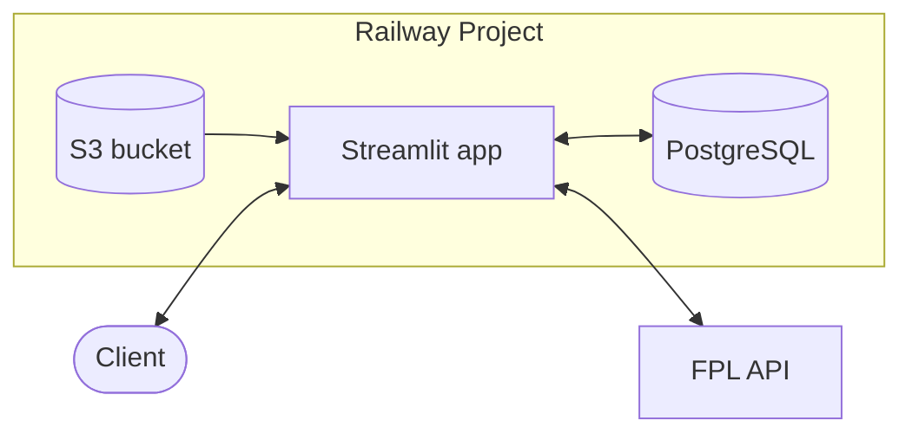

# FPL Cheat 

### Are your mates copying content creators' Fantasy Premier League teams? Catch them out.

 

&nbsp;
&nbsp;
&nbsp;
&nbsp;

 

FPL Cheat scores your squad against content-creator teams and shows your three closest matches player by
player — so you can tell whether that inspired differential came was just from TikTok.

- Search any of ~10 million FPL managers
- Search by name or team without having to [acquire your manager id](https://fpl.team/find-fpl-team-id/)
- No signup required

 

## How it works

1. Search for your team by — team name, manager name, or manager ID.
2. Your squad is compared against every creator team automatically; the closest matches appear below.
3. Pick one to see the side-by-side pitch, with shared players highlighted.

## Features

- 🔍 **Smart Team Search**: Search by name or manager without having to [acquire your team id](https://fpl.team/find-fpl-team-id/).
- 📊 **Similarity Analysis**: Compare with content-creator teams and see the top 3 matches
- ⚽ **Visual Pitch Display**: Side-by-side team comparison with jersey images and shared-player highlighting
- 🔄 **Auto-Updates**: Creator teams update at 5pm and midnight UK time while the app process is running
- 💾 **Smart Caching**: Streamlit caching for FPL API calls to reduce repeat requests

## Troubleshooting

- **"Failed to fetch picks" or "No picks found"?** FPL only publishes a squad once the gameweek
  deadline has passed, so there is nothing to compare for a brand-new team or a gameweek that hasn't
  started yet. Try again after the next deadline, or check the manager ID is right.

- **A creator's team missing for this gameweek?** Creator squads refresh at 5pm and midnight UK time,
  so there can be a short gap just after a deadline before the new ones appear. Check back later.

## Architecture

A dockerised Streamlit app running on Railway, alongside a private PostgreSQL service that holds the
manager lookup and the creator squads. Club jerseys and the favicon come from an S3-compatible bucket
and are inlined into the page at render time.

Search and the stored creator squads come from Postgres, which is private to the Railway project. Live
squads are pulled from the FPL API on demand, and an in-app scheduler refreshes the creator squads at
5pm and midnight UK time.

### Manager Fetch Logic

The fpl endpoint used for acquiring a users teams requires their user_id. This can only be accessed via
logging in the offical fpl website and checking the url once logged in. However a managers name and team name can
be mapped to their id via the overall league endpoint.

The manager lookup database (`all_managers`) is populated from the public FPL overall league standings
endpoint using `scripts/fetch_fpl_data.py`, this stores and indexes manager name, team name, and
manager ID in the database to allow search via any of the 3 fields over 10+ million rows.

Name and team search is backed by `pg_trgm` GIN indexes, which are what make `ILIKE` indexable at all —
a plain btree cannot serve it. The extension is a requirement of the schema and is created by
`_init_tables`. Creator comparison squads are stored separately in `creator_teams` (player_1 to
player_15 plus current gameweek).

## License

[MIT](LICENSE) © Pete Matthews
